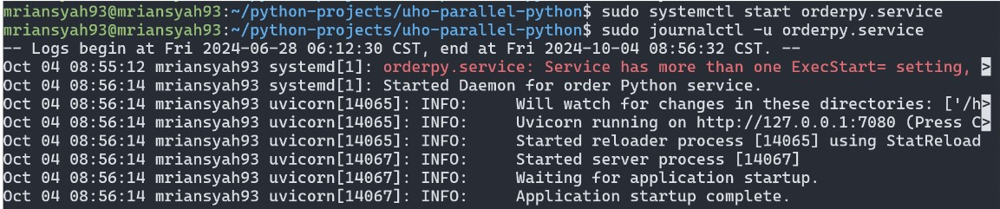

# Panduan pembuatan dameon process
NIM: F1G11230244 
Nama: Muhammad Riansyah Tohamba

Pada tulisan ini saya akan memaparkan tahapan pembuatan daemon process

## Buat file .service
masuk sebagai superuser, lalu jalankan perintah
```bash
$ sudo touch /etc/systemd/system/rian.service
```

## Penulisan script konfigurasi .service

```bash
[Unit]
Description=Contoh Daemon

[Service]
Restart=always
WorkingDirectory=/home/mriansyah93/python-projects/uho-parallel-python
Environment="PYTHONPATH=/home/mriansyah93/.local/lib/python3.8/site-packages"
ExecStart=/home/mriansyah93/.local/bin/uvicorn main:app --reload --port 7080

[Install]
WantedBy=multi-user.target
```

## jalankan perintah daemon
```bash
$ sudo systemctl daemon-reload 
$ sudo systemctl enable rian.service 
$ sudo systemctl start rian.service
```

## Bukti daemon telah berjalan

